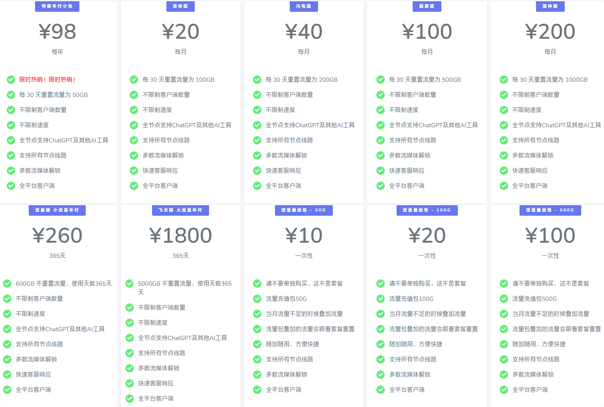
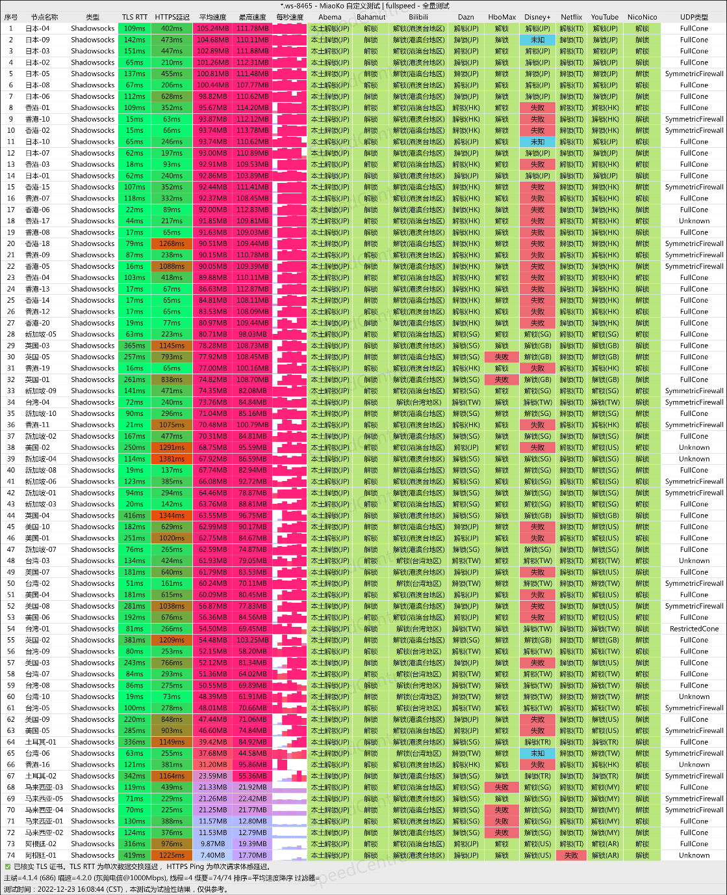

# speedcat闪电猫vpn官网地址 + 最新优惠码

speedcat永久官网：[speedcat.co](https://xuv.cc/out/cat)

## speedcat闪电猫vpn介绍

闪电猫 SpeedCAT 主推高端稳定IPLC专线机场，采用 Shadowsocks协议，全平台兼容良好，解锁 ChatGPT 以及奈飞等热门流媒体。还提供企业套餐，适合外贸工作。

机场节点：香港、日本、台湾、新加坡、美国、英国、加拿大、印度、土耳其、巴西、德国、泰国、澳大利亚、马来西亚等。

### speedcat闪电猫vpn特点

>闪电猫是一个海外的SS机场，重新定义科学上网，主打快速稳定，全专线IPLC，没有倍率、没有套路，承诺买多少给多少。
>
>全球120+节点，覆盖香港、台湾、日本、美国、新加坡、英国、韩国等，还有越南、阿根廷、土耳其、马来西亚、菲律宾、印度等小众需求的国家地区。
>
>全节点支持流媒体解锁（包括Netflix , Disney+, HBO等）。
>
>完美解锁ChatGPT，支持Tiktok本土短视频运营和直播。
>
>晚高峰不限速，无视高峰期稳定不动摇，所有套餐x1倍率。
>
>节点速度高达5 GBPS

## speedcat闪电猫优惠码

Speedcat祝福大家春节快乐，所有现在的套餐都已经自动折扣了，比如年付套餐，已经8折，加上新春活动7折之后再八折相当于5.6折，力度相当诱人！！！

7折优惠码：[CHUNJIE70](https://xuv.cc/out/cat)

## speedcat闪电猫套餐价格

闪电猫热门套餐低至¥98每年，常规套餐年付优惠力度更大。

|套餐|迷你猫|闪电猫|霹雳猫|雷神猫|流星猫（小流量年付）|飞天猫（大流量年付）|
|----|----|----|----|----|----|----|
|月付|￥20|￥40|￥100|￥200| - | - |
|季付|￥57|￥114|￥285|￥570| - | - |
|半年付|￥108|￥216|￥540|￥1080| - | - |
|年付|￥192|￥384|￥960|￥1920|￥260|￥1800|

**特惠年付小包**

热门套餐推荐：[speedcat小年包](https://xuv.cc/out/cat)（￥98/年，每月50G流量）

## 闪电猫好用吗？

目前试用没有什么问题，速度、稳定性都不错，全节点解锁ChatGPT，性价比很高。

### speedcat闪电猫机场速度怎么样？

参考一下网友测速：

## 温馨提示

> speedcat跑路了吗？暂时没有。不过机场总会有跑路风险，为尽可能减少损失，选购套餐可按月支付。
> 另外没有啥绝对好坏，一线机场也会炸，小机场也可能岁月静好。
